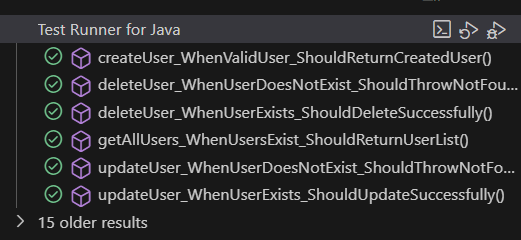

 

## Integrantes del proyecto 👩🏻‍💻👨🏽‍💻👨🏻‍💻
 - Carolina Medina Acero
 - Andres Felipe Montes ortiz
 - Cristian David Naranjo Orjuela

 ## Descripción del proyecto RoomMatch 🏡
 - **¿Problema?** Encontrar un compañero de cuarto compatible es difícil y arriesgado. Los métodos tradicionales son ineficientes, llevan tiempo y pueden generar conflictos por diferencias en hábitos, personalidad o presupuesto.

 - **Oportunidad** La Creciente demanda de viviendas compartidas por teletrabajo y movilidad estudiantil.

 - **¿Nuestra solución?** RoomMatch AI es una plataforma web y app que usa Inteligencia Artificial para conectar personas que buscan compartir vivienda, analizando gustos, hábitos y presupuesto en tiempo real.

 - **¿Por qué RoomMatch ?** Porque vivir con alguien compatible mejora la experiencia de compartir hogar, reduce conflictos y hace que la convivencia sea más armoniosa y segura. ¡Encuentra tu roomie ideal sin estrés! 

## Versión del lenguaje
Para ejecutar este proyecto, necesitarás tener instalado:

- Java JDK 17.
- Un IDE de Java como IntelliJ IDEA, Eclipse, o NetBeans.
- Maven para manejar las dependencias preferiblemente la version 3.9.4
- Un navegador web para interactuar con el servidor.
## Dependencias iniciales
- Spring Boot Starter Data JPA 
- Spring Boot Starter Test
- Spring Boot Starter Web
- Spring Boot DevTools
- MySQL Connector
- H2 Database
- spring-boot-starter-data-mongodb

## Instrucciones claras para instalar y ejecutar el proyecto
### Instalación

1. Tener instalado Git en tu máquina local
2. Elegir una carpeta en donde guardes tu proyecto
3. abrir la terminal de GIT --> mediante el click derecho seleccionas Git bash here
4. Clona el repositorio en tu máquina local:
   ```bash
   git clone https://github.com/cristiandavid0124/Vanguardix.git
   ```
### Ejecutar 
1. Abre el proyecto con tu IDE favorito o navega hasta el directorio del proyecto
2. Desde la terminal para compilar y empaquetar el proyecto ejecuta:

   ```bash
   mvn clean install
   ```
3.  Compila el proyecto que contiene el método MAIN: ProyectoApplication.java o ejecuta desde la terminal

    ```bash
    mvn spring-boot:run
    ```

4. Puedes interactuar con los endpoints RESTful API con  Madurez Nivel 2:
    -  GET http://localhost:8080/users para obtener todos los usuarios 
    -  POST http://localhost:8080/users para crear un nuevo  usuario
    -  PUT http://localhost:8080/users/{id} para actualizar un usuario existente con ese id
    -  DELETE http://localhost:8080/users/{id} para eliminar un usuario existente con ese id

## Enlace al documento o herramienta de planeación del proyecto 
 - Backlog del proyecto [Backlog del proyecto](https://github.com/users/cristiandavid0124/projects/2).

## Ejecutar las pruebas

Se implementaron pruebas unitarias para los métodos de manejo de solicitudes HTTP (GET, POST, PUT, DELETE) en el servidor. Estas pruebas se realizaron utilizando JUnit y Mockito para simular las solicitudes y validar las respuestas.

Para ejecutar las pruebas:  
1. Desde tu IDE, ejecuta las clase AppTest.java o desde la terminal ejecutas:
   ```bash
   mvn test
   ```
### Desglosar en pruebas de extremo a extremo

- **deleteUser_WhenUserExists_ShouldDeleteSuccessfully**: Prueba la eliminación de un usuario existente.Verifica que el método deleteById se llame y que el código HTTP sea 204.
- **deleteUser_WhenUserDoesNotExist_ShouldThrowNotFound**: Prueba la eliminación de un usuario inexistente.Verifica que se lance una excepción ResponseStatusException con código HTTP 404.
- **updateUser_WhenUserExists_ShouldUpdateSuccessfully**:Prueba la actualización de un usuario existente.Verifica que los cambios sean guardados y que el código HTTP sea 200.
- **updateUser_WhenUserDoesNotExist_ShouldThrowNotFound**:Prueba la actualización de un usuario inexistente.actualizados.Verifica que se lance una excepción ResponseStatusException con código HTTP 404.
- **getAllUsers_WhenUsersExist_ShouldReturnUserList()**:Prueba unitaria para verificar que el método getAllUsers() retorna una lista de usuarios cuando existen usuarios en la base de datos. y que la respuesta HTTP tiene el estado 200 OK.
- **createUser_WhenValidUser_ShouldReturnCreatedUser**:Prueba unitaria para verificar que el método createUser(),guarda correctamente un usuario en la base de datos,y que la respuesta HTTP tiene el estado 201 CREATED.
- 

 ## Built With
* [Maven](https://maven.apache.org/) - Dependency Management


   
